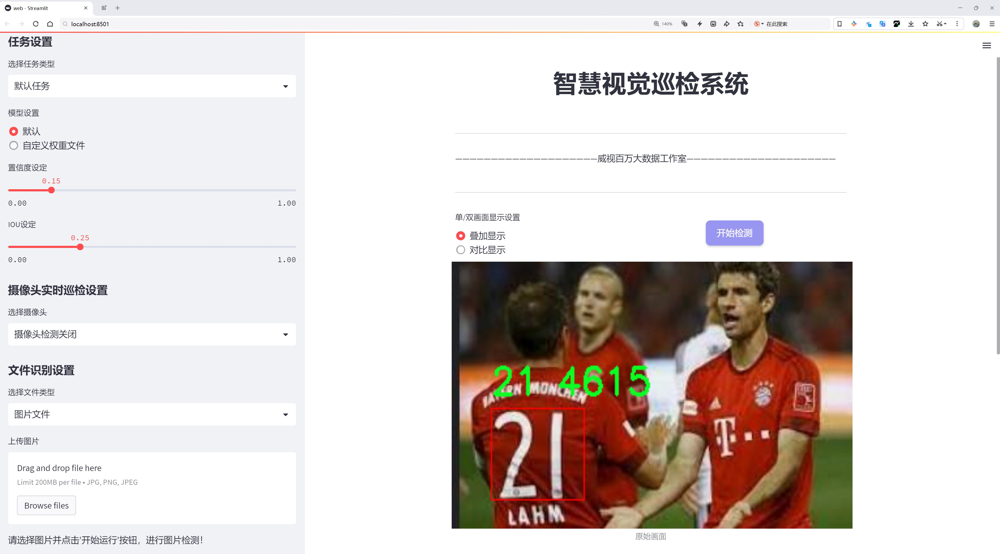
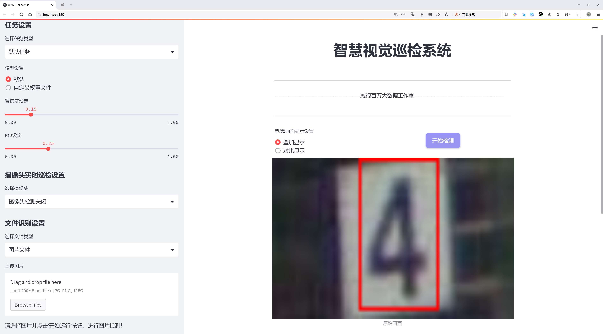
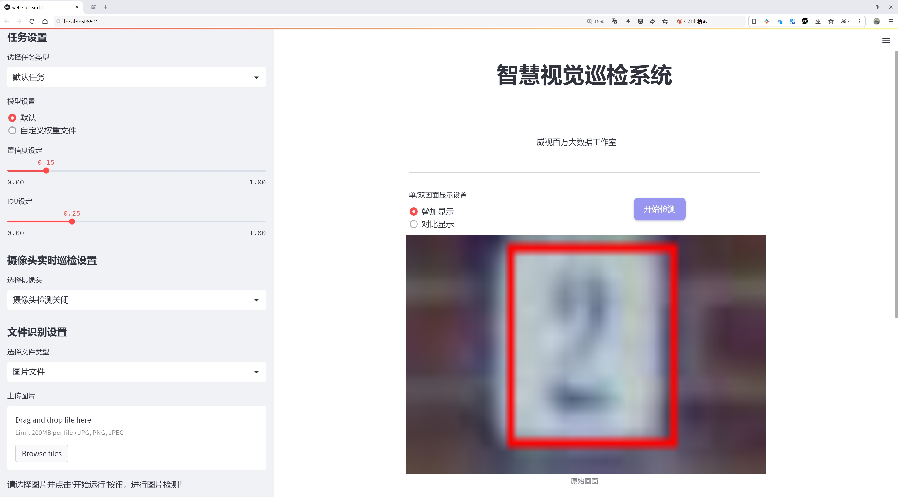
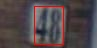
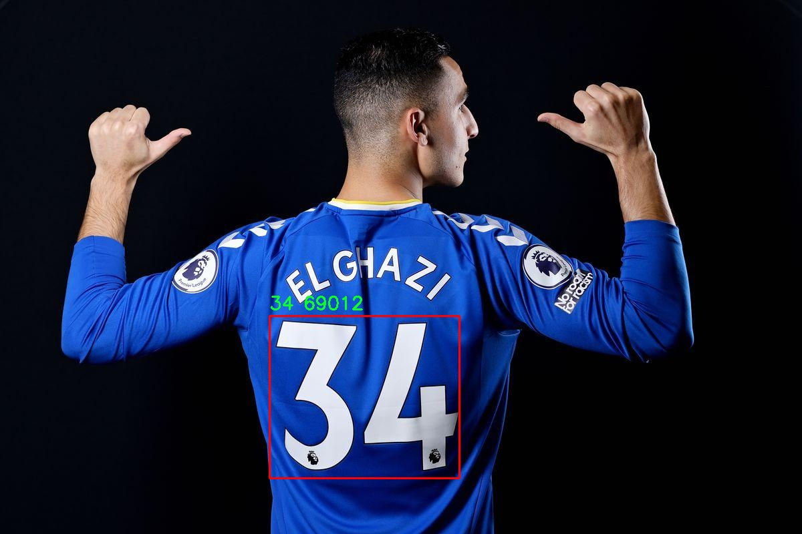
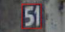
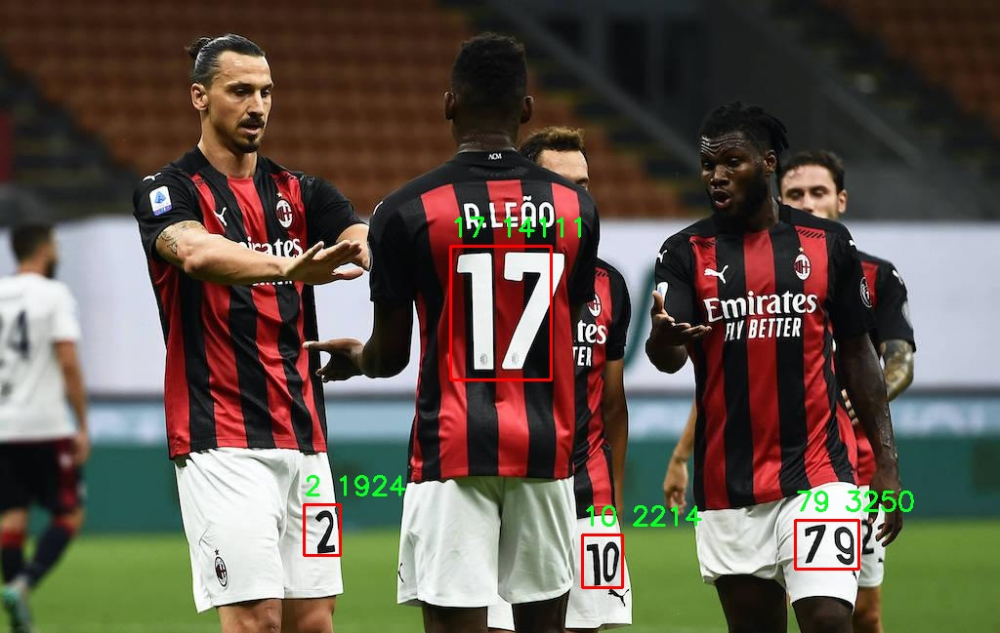

# 运动员球衣号码检测系统源码分享
 # [一条龙教学YOLOV8标注好的数据集一键训练_70+全套改进创新点发刊_Web前端展示]

### 1.研究背景与意义

项目参考[AAAI Association for the Advancement of Artificial Intelligence](https://gitee.com/qunmasj/projects)

研究背景与意义

在现代体育竞技中，运动员的表现不仅依赖于其个人技术和团队配合，还受到观众、教练和分析师对比赛过程的实时监控和分析的影响。随着科技的进步，尤其是计算机视觉和深度学习技术的发展，运动数据的自动化采集和分析成为可能。运动员球衣号码的自动检测，作为比赛分析和运动员识别的重要环节，正逐渐受到学术界和产业界的广泛关注。

传统的运动员识别方法往往依赖于人工标注和手动识别，这不仅效率低下，而且容易受到人为因素的影响。随着比赛节奏的加快和观众需求的增加，如何快速、准确地识别运动员的球衣号码，成为提升比赛分析效率和观众体验的关键。因此，基于深度学习的自动检测系统应运而生，特别是改进的YOLOv8模型，以其高效的实时检测能力和良好的精度，成为解决这一问题的理想选择。

本研究所采用的数据集包含6130张图像，涵盖了100个类别的球衣号码，从0到99的号码均有涉及。这一丰富的数据集为模型的训练和测试提供了坚实的基础，能够有效提升模型在复杂场景下的识别能力。通过对不同号码的分类，模型不仅能够识别运动员的身份，还能为后续的战术分析和比赛数据统计提供支持。尤其是在多场景、多角度的比赛环境中，如何提高模型的鲁棒性和准确性，成为研究的重点。

改进YOLOv8模型的研究意义在于，首先，它能够显著提高运动员球衣号码的检测精度和速度，满足实时分析的需求。其次，通过对模型的优化，能够降低对计算资源的消耗，使得该系统能够在更广泛的设备上运行，从而实现更大的应用场景。此外，基于深度学习的检测系统还能够通过不断学习和更新，适应不同赛事和不同运动项目的需求，具有良好的可扩展性。

在实际应用中，该检测系统不仅可以用于比赛直播中的实时数据分析，还可以为教练团队提供详细的运动员表现数据，帮助其制定更为科学的训练计划和战术策略。同时，随着智能体育的不断发展，该系统还可以与其他智能设备和应用相结合，形成一个完整的运动员监控和分析生态系统，推动体育科技的进一步发展。

综上所述，基于改进YOLOv8的运动员球衣号码检测系统，不仅在技术上具有重要的创新意义，更在实际应用中展现出广阔的前景。通过本研究的深入，期望能够为体育数据分析领域提供新的思路和方法，推动智能体育的发展进程。

### 2.图片演示







##### 注意：由于此博客编辑较早，上面“2.图片演示”和“3.视频演示”展示的系统图片或者视频可能为老版本，新版本在老版本的基础上升级如下：（实际效果以升级的新版本为准）

  （1）适配了YOLOV8的“目标检测”模型和“实例分割”模型，通过加载相应的权重（.pt）文件即可自适应加载模型。

  （2）支持“图片识别”、“视频识别”、“摄像头实时识别”三种识别模式。

  （3）支持“图片识别”、“视频识别”、“摄像头实时识别”三种识别结果保存导出，解决手动导出（容易卡顿出现爆内存）存在的问题，识别完自动保存结果并导出到。

  （4）支持Web前端系统中的标题、背景图等自定义修改，后面提供修改教程。

  另外本项目提供训练的数据集和训练教程,暂不提供权重文件（best.pt）,需要您按照教程进行训练后实现图片演示和Web前端界面演示的效果。

### 3.视频演示

[3.1 视频演示](https://www.bilibili.com/video/BV1SbsceuE3P/?vd_source=ff015de2d29cbe2a9cdbfa7064407a08)

### 4.数据集信息展示

数据集信息展示

本数据集名为“jersey_number”，专为改进YOLOv8的运动员球衣号码检测系统而设计，包含6130张图像，涵盖了100个类别。这些类别代表了运动员球衣上的号码，从0到99，充分满足了多种运动项目中对号码识别的需求。数据集的构建旨在提高模型在实际应用中的准确性和鲁棒性，尤其是在复杂的运动场景中。

数据集中包含的图像来源广泛，涵盖了不同运动类型和环境条件下的运动员，确保了训练数据的多样性和代表性。每张图像都经过精心标注，确保每个球衣号码都被准确识别和定位。这种高质量的标注为YOLOv8模型的训练提供了坚实的基础，使其能够在各种情况下准确识别运动员的号码。

在类别设计上，数据集从0到99的号码设计使得模型能够处理所有可能的单个和双位数的球衣号码。这种设计不仅适用于常见的团队运动，如足球、篮球和排球，也适用于其他需要号码识别的运动项目。通过涵盖广泛的号码范围，数据集能够帮助模型学习到不同号码的特征，进而提高其在实际应用中的识别能力。

数据集的使用许可为CC BY 4.0，这意味着用户可以自由使用、修改和分发数据集，只需在使用时给予适当的署名。这种开放的许可方式鼓励了学术界和工业界的广泛应用，促进了运动员号码检测技术的研究与发展。

为了确保数据集的有效性和实用性，数据集在构建过程中遵循了严格的质量控制标准。每张图像都经过多次审核，以确保标注的准确性和一致性。这种高标准的质量控制使得数据集在训练过程中能够有效减少噪声，提高模型的学习效率。

在实际应用中，改进后的YOLOv8模型将能够在实时视频流中快速识别运动员的球衣号码，为赛事分析、运动员跟踪和数据统计提供重要支持。通过对运动员号码的准确识别，相关团队和教练可以更好地分析比赛表现，制定相应的战术策略。此外，球迷和观众也能够通过实时数据获取更丰富的比赛信息，提升观赛体验。

总之，数据集“jersey_number”不仅为YOLOv8模型的训练提供了丰富的素材，也为运动员球衣号码检测技术的发展奠定了基础。随着数据集的不断优化和扩展，未来在运动分析、智能监控等领域的应用前景将更加广阔。










### 5.全套项目环境部署视频教程（零基础手把手教学）

[5.1 环境部署教程链接（零基础手把手教学）](https://www.ixigua.com/7404473917358506534?logTag=c807d0cbc21c0ef59de5)


[5.2 安装Python虚拟环境创建和依赖库安装视频教程链接（零基础手把手教学）](https://www.ixigua.com/7404474678003106304?logTag=1f1041108cd1f708b01a)

### 6.手把手YOLOV8训练视频教程（零基础小白有手就能学会）

[6.1 环境部署教程链接（零基础手把手教学）](https://www.ixigua.com/7404477157818401292?logTag=d31a2dfd1983c9668658)

### 7.70+种全套YOLOV8创新点代码加载调参视频教程（一键加载写好的改进模型的配置文件）

[7.1 环境部署教程链接（零基础手把手教学）](https://www.ixigua.com/7404478314661806627?logTag=29066f8288e3f4eea3a4)

### 8.70+种全套YOLOV8创新点原理讲解（非科班也可以轻松写刊发刊，V10版本正在科研待更新）

由于篇幅限制，每个创新点的具体原理讲解就不一一展开，具体见下列网址中的创新点对应子项目的技术原理博客网址【Blog】：


[8.1 70+种全套YOLOV8创新点原理讲解链接](https://gitee.com/qunmasj/good)

### 9.系统功能展示（检测对象为举例，实际内容以本项目数据集为准）

图1.系统支持检测结果表格显示

  图2.系统支持置信度和IOU阈值手动调节

  图3.系统支持自定义加载权重文件best.pt(需要你通过步骤5中训练获得)

  图4.系统支持摄像头实时识别

  图5.系统支持图片识别

  图6.系统支持视频识别

  图7.系统支持识别结果文件自动保存

  图8.系统支持Excel导出检测结果数据


### 10.原始YOLOV8算法原理

原始YOLOv8算法原理

YOLOv8作为YOLO系列的最新版本，继承并优化了前几代模型的核心思想，旨在通过高效的目标检测技术满足日益增长的应用需求。该算法的设计围绕着三个主要组成部分展开：Backbone、Neck和Head，每一部分都在特征提取和目标检测的过程中发挥着至关重要的作用。

在Backbone部分，YOLOv8采用了CSPDarknet结构，这是一种创新的网络架构，旨在通过分段处理来提高特征提取的效率。CSPDarknet将输入图像分为两个部分，每个部分都包含多个残差块，这种设计不仅提升了网络的表达能力，还增强了模型的梯度流动性。与YOLOv5相比，YOLOv8引入了C2f模块，替代了传统的C3模块。C2f模块通过将特征图分成两个分支并分别进行降维处理，进一步丰富了特征的多样性。每个分支的输出都被视为独立的特征流，这种设计使得网络能够在不同层次上捕捉到更多的信息，进而形成更高维度的特征图。

为了有效提取不同尺度的特征，YOLOv8还引入了快速空间金字塔池化（SPPF）结构。SPPF的设计理念是通过多尺度的特征融合，减少模型的参数量和计算量，同时提高特征提取的效率。这一结构的引入使得YOLOv8在处理复杂场景时，能够更好地适应不同大小的目标，从而显著提升了检测的准确性和鲁棒性。

在Neck部分，YOLOv8采用了特征金字塔网络（FPN）与路径聚合网络（PAN）的结合，进一步增强了特征的融合能力。通过多层次的卷积和池化操作，Neck部分能够有效地整合来自Backbone不同阶段的特征图。这种多尺度特征融合技术不仅提高了模型对不同尺寸目标的捕捉能力，还增强了其在复杂背景下的检测性能。通过这种结构，YOLOv8能够在多种场景下实现更为精确的目标检测，满足了智能监控、自动驾驶等领域对高性能检测系统的需求。

在Head部分，YOLOv8的设计同样具有创新性。它采用了无锚框（Anchor-Free）的检测方式，直接预测目标的中心点和宽高比例。这一方法的优势在于，减少了对Anchor框的依赖，降低了模型的复杂性，同时提高了检测速度和准确度。通过将特征图经过一系列卷积层和全连接层的处理，YOLOv8能够高效地生成目标检测结果。Head部分设有多个检测头，能够在不同的尺寸信息下进行目标的检测和分类，进一步提升了模型的灵活性和适应性。

YOLOv8的训练和部署框架也进行了重大的改进，使得自定义模型的训练变得更加方便。通过引入多尺度训练和测试策略，YOLOv8能够在不同的训练阶段适应多样化的输入数据，从而提升模型的泛化能力。此外，YOLOv8在精度和帧率上均有显著提升，相较于YOLOv7，YOLOv8在mAP（mean Average Precision）和帧率方面的表现均有所提高，这使得它在实际应用中能够更好地满足实时性和准确性的双重需求。

总的来说，YOLOv8通过对Backbone、Neck和Head的精心设计与优化，形成了一种高效的目标检测算法。其在特征提取、特征融合和目标检测等方面的创新，使得YOLOv8在各类目标检测任务中表现出色。无论是在智能监控、自动驾驶还是人脸识别等应用场景中，YOLOv8都展现出了强大的性能和灵活性，成为了目标检测领域的重要工具。随着YOLOv8的广泛应用，未来的研究和开发将继续围绕其核心原理展开，推动目标检测技术的不断进步与创新。


### 11.项目核心源码讲解（再也不用担心看不懂代码逻辑）

#### 11.1 ultralytics\models\__init__.py

下面是对给定代码的逐行分析，并保留核心部分，同时添加详细的中文注释：

```python
# Ultralytics YOLO 🚀, AGPL-3.0 license

# 从当前包中导入 RTDETR、SAM 和 YOLO 模块
from .rtdetr import RTDETR  # 导入 RTDETR 类或函数
from .sam import SAM        # 导入 SAM 类或函数
from .yolo import YOLO      # 导入 YOLO 类或函数

# 定义模块的公开接口，允许用户以简单的方式导入这些类或函数
__all__ = "YOLO", "RTDETR", "SAM"  # 只允许从该模块导入 YOLO、RTDETR 和 SAM
```

### 代码分析
1. **模块导入**：
   - 代码通过 `from .module import Class` 的方式导入了三个模块：`RTDETR`、`SAM` 和 `YOLO`。这些模块可能是实现特定功能的类或函数，具体功能取决于它们的定义。

2. **`__all__` 的定义**：
   - `__all__` 是一个特殊的变量，用于定义模块的公共接口。当使用 `from module import *` 的方式导入时，只有在 `__all__` 中列出的名称会被导入。这有助于控制模块的可见性，避免不必要的名称冲突。

### 核心部分
- 核心部分主要是模块的导入和 `__all__` 的定义，这两部分是实现模块功能和控制模块接口的关键。

这个文件是Ultralytics YOLO项目中的一个初始化文件，通常用于模块的组织和导入。在Python中，`__init__.py`文件的存在使得包含它的目录被视为一个包，从而可以在其他地方导入这个包中的模块。

在这个文件中，首先有一个注释，指出这是Ultralytics YOLO项目，并提到该项目遵循AGPL-3.0许可证。这种许可证通常用于开源软件，允许用户自由使用、修改和分发软件，但要求在分发时保持相同的许可证。

接下来，文件通过相对导入的方式引入了三个模块：`RTDETR`、`SAM`和`YOLO`。这些模块可能包含与目标检测和图像分割相关的不同实现或功能。具体来说，`YOLO`通常指的是一种流行的目标检测算法，而`RTDETR`和`SAM`可能是与该项目相关的其他模型或算法。

最后，`__all__`变量被定义为一个元组，包含了字符串"YOLO"、"RTDETR"和"SAM"。这个变量的作用是控制当使用`from module import *`语句时，哪些名称会被导入。通过定义`__all__`，开发者可以明确指定哪些模块是公共接口的一部分，从而简化用户的导入过程。

总的来说，这个文件的主要功能是组织和简化模块的导入，使得用户可以方便地使用YOLO及其相关的模型。

#### 11.2 ui.py

```python
import sys
import subprocess

def run_script(script_path):
    """
    使用当前 Python 环境运行指定的脚本。

    Args:
        script_path (str): 要运行的脚本路径

    Returns:
        None
    """
    # 获取当前 Python 解释器的路径
    python_path = sys.executable

    # 构建运行命令，使用 streamlit 运行指定的脚本
    command = f'"{python_path}" -m streamlit run "{script_path}"'

    # 执行命令
    result = subprocess.run(command, shell=True)
    # 检查命令执行结果，如果返回码不为0，表示执行出错
    if result.returncode != 0:
        print("脚本运行出错。")

# 主程序入口
if __name__ == "__main__":
    # 指定要运行的脚本路径
    script_path = "web.py"  # 假设脚本在当前目录下

    # 调用函数运行脚本
    run_script(script_path)
```

### 代码核心部分说明：
1. **导入模块**：
   - `sys`：用于获取当前 Python 解释器的路径。
   - `subprocess`：用于执行外部命令。

2. **`run_script` 函数**：
   - 接收一个参数 `script_path`，表示要运行的 Python 脚本的路径。
   - 使用 `sys.executable` 获取当前 Python 解释器的路径。
   - 构建一个命令字符串，使用 `streamlit` 模块运行指定的脚本。
   - 使用 `subprocess.run` 执行命令，并检查返回码以判断脚本是否成功运行。

3. **主程序入口**：
   - 在 `if __name__ == "__main__":` 块中，指定要运行的脚本路径，并调用 `run_script` 函数执行该脚本。

这个程序文件名为 `ui.py`，主要功能是使用当前的 Python 环境来运行一个指定的脚本。文件中首先导入了必要的模块，包括 `sys`、`os` 和 `subprocess`，以及一个自定义的路径处理模块 `abs_path`。

在 `run_script` 函数中，程序接受一个参数 `script_path`，这个参数是要运行的脚本的路径。函数内部首先获取当前 Python 解释器的路径，这通过 `sys.executable` 实现。接着，构建一个命令字符串，命令的格式是使用 Python 解释器运行 `streamlit` 模块，并指定要运行的脚本路径。

然后，使用 `subprocess.run` 方法执行这个命令。`shell=True` 参数表示命令将在一个新的 shell 中执行。执行后，程序检查返回的结果码，如果结果码不为零，说明脚本运行出错，此时会打印出相应的错误信息。

在文件的最后部分，使用 `if __name__ == "__main__":` 语句来确保只有在直接运行该文件时才会执行后面的代码。在这里，指定了要运行的脚本路径为 `web.py`，并调用 `run_script` 函数来执行这个脚本。

整体来看，这个程序的主要作用是提供一个简单的接口，通过命令行运行一个名为 `web.py` 的脚本，利用 `streamlit` 库来启动一个 web 应用。

#### 11.3 ultralytics\models\sam\modules\decoders.py

以下是经过简化和注释的核心代码部分，主要集中在 `MaskDecoder` 类及其重要方法上：

```python
import torch
from torch import nn
from torch.nn import functional as F
from ultralytics.nn.modules import LayerNorm2d

class MaskDecoder(nn.Module):
    """
    MaskDecoder 类用于生成图像的掩码及其质量评分，使用变换器架构来预测掩码。
    """

    def __init__(self, transformer_dim: int, transformer: nn.Module, num_multimask_outputs: int = 3) -> None:
        """
        初始化 MaskDecoder。

        参数:
            transformer_dim (int): 变换器模块的通道维度。
            transformer (nn.Module): 用于预测掩码的变换器。
            num_multimask_outputs (int): 预测的掩码数量，用于消歧。
        """
        super().__init__()
        self.transformer_dim = transformer_dim  # 变换器的通道维度
        self.transformer = transformer  # 变换器模块

        self.num_multimask_outputs = num_multimask_outputs  # 预测的掩码数量

        # 定义 IoU 令牌和掩码令牌的嵌入
        self.iou_token = nn.Embedding(1, transformer_dim)  # IoU 令牌的嵌入
        self.mask_tokens = nn.Embedding(num_multimask_outputs + 1, transformer_dim)  # 掩码令牌的嵌入

        # 输出上采样网络
        self.output_upscaling = nn.Sequential(
            nn.ConvTranspose2d(transformer_dim, transformer_dim // 4, kernel_size=2, stride=2),
            LayerNorm2d(transformer_dim // 4),
            nn.GELU(),  # 激活函数
            nn.ConvTranspose2d(transformer_dim // 4, transformer_dim // 8, kernel_size=2, stride=2),
            nn.GELU(),
        )

        # 超网络 MLP 列表，用于生成掩码
        self.output_hypernetworks_mlps = nn.ModuleList(
            [MLP(transformer_dim, transformer_dim, transformer_dim // 8, 3) for _ in range(num_multimask_outputs + 1)]
        )

        # IoU 预测头
        self.iou_prediction_head = MLP(transformer_dim, 256, num_multimask_outputs + 1, 3)

    def forward(self, image_embeddings: torch.Tensor, sparse_prompt_embeddings: torch.Tensor, multimask_output: bool) -> Tuple[torch.Tensor, torch.Tensor]:
        """
        根据图像和提示嵌入预测掩码。

        参数:
            image_embeddings (torch.Tensor): 图像编码器的嵌入。
            sparse_prompt_embeddings (torch.Tensor): 稀疏提示的嵌入。
            multimask_output (bool): 是否返回多个掩码。

        返回:
            torch.Tensor: 预测的掩码。
            torch.Tensor: 掩码质量的预测。
        """
        # 预测掩码和 IoU
        masks, iou_pred = self.predict_masks(image_embeddings, sparse_prompt_embeddings)

        # 根据 multimask_output 选择掩码
        mask_slice = slice(1, None) if multimask_output else slice(0, 1)
        masks = masks[:, mask_slice, :, :]
        iou_pred = iou_pred[:, mask_slice]

        return masks, iou_pred

    def predict_masks(self, image_embeddings: torch.Tensor, sparse_prompt_embeddings: torch.Tensor) -> Tuple[torch.Tensor, torch.Tensor]:
        """
        预测掩码。

        参数:
            image_embeddings (torch.Tensor): 图像嵌入。
            sparse_prompt_embeddings (torch.Tensor): 稀疏提示嵌入。

        返回:
            torch.Tensor: 预测的掩码。
            torch.Tensor: IoU 预测。
        """
        # 连接输出令牌
        output_tokens = torch.cat([self.iou_token.weight, self.mask_tokens.weight], dim=0)
        output_tokens = output_tokens.unsqueeze(0).expand(sparse_prompt_embeddings.size(0), -1, -1)
        tokens = torch.cat((output_tokens, sparse_prompt_embeddings), dim=1)

        # 扩展每个图像的数据以适应每个掩码
        src = image_embeddings.repeat(tokens.shape[0], 1, 1, 1) + sparse_prompt_embeddings
        pos_src = image_embeddings  # 位置编码（这里简化处理）

        # 运行变换器
        hs, src = self.transformer(src, pos_src, tokens)
        iou_token_out = hs[:, 0, :]  # IoU 令牌输出
        mask_tokens_out = hs[:, 1 : (1 + self.num_multimask_outputs), :]  # 掩码令牌输出

        # 上采样掩码嵌入并预测掩码
        upscaled_embedding = self.output_upscaling(src)
        hyper_in_list = [self.output_hypernetworks_mlps[i](mask_tokens_out[:, i, :]) for i in range(self.num_multimask_outputs + 1)]
        hyper_in = torch.stack(hyper_in_list, dim=1)
        masks = (hyper_in @ upscaled_embedding.view(upscaled_embedding.size(0), -1)).view(upscaled_embedding.size(0), -1, upscaled_embedding.size(2), upscaled_embedding.size(3))

        # 生成 IoU 预测
        iou_pred = self.iou_prediction_head(iou_token_out)

        return masks, iou_pred

class MLP(nn.Module):
    """
    多层感知机（MLP）模型。
    """

    def __init__(self, input_dim: int, hidden_dim: int, output_dim: int, num_layers: int) -> None:
        """
        初始化 MLP。

        参数:
            input_dim (int): 输入特征的维度。
            hidden_dim (int): 隐藏层的维度。
            output_dim (int): 输出层的维度。
            num_layers (int): 隐藏层的数量。
        """
        super().__init__()
        self.layers = nn.ModuleList(nn.Linear(n, k) for n, k in zip([input_dim] + [hidden_dim] * (num_layers - 1), [hidden_dim] * (num_layers - 1) + [output_dim]))

    def forward(self, x):
        """执行前向传播并应用激活函数。"""
        for i, layer in enumerate(self.layers):
            x = F.relu(layer(x)) if i < len(self.layers) - 1 else layer(x)  # 最后一层不使用激活函数
        return x
```

### 代码注释说明：
1. **MaskDecoder 类**：该类是一个神经网络模块，负责根据输入的图像嵌入和提示嵌入生成掩码及其质量评分。
2. **初始化方法**：定义了模型的结构，包括变换器、掩码令牌、IoU 令牌、上采样网络和用于生成掩码的超网络 MLP。
3. **forward 方法**：主要逻辑是根据输入的图像和提示嵌入预测掩码，支持多掩码输出。
4. **predict_masks 方法**：具体实现掩码预测的逻辑，包括令牌的拼接、变换器的运行和掩码的生成。
5. **MLP 类**：定义了一个简单的多层感知机结构，用于处理特征的映射。

这个程序文件定义了一个名为 `MaskDecoder` 的类，它是一个用于生成图像掩码及其质量评分的解码器模块，采用了变换器（Transformer）架构。该类的主要功能是根据图像和提示嵌入来预测掩码。

在 `MaskDecoder` 类的构造函数中，初始化了一些重要的属性，包括变换器的维度、变换器模块本身、要预测的掩码数量、IoU（Intersection over Union）标记的嵌入、掩码标记的嵌入以及用于上采样输出的神经网络序列。上采样部分使用了转置卷积和层归一化，结合激活函数来处理特征图。该类还定义了一个多层感知机（MLP）用于生成掩码和预测掩码质量。

`forward` 方法是类的核心，它接收图像嵌入、位置编码、稀疏提示嵌入和密集提示嵌入，并根据这些输入生成掩码和IoU预测。根据 `multimask_output` 参数的值，选择返回多个掩码或单个掩码。

`predict_masks` 方法则是具体的掩码预测过程。它首先将IoU标记和掩码标记的嵌入连接在一起，然后与图像嵌入和提示嵌入结合，形成输入到变换器的源数据。经过变换器处理后，提取出IoU标记和掩码标记的输出，随后通过上采样和MLP生成最终的掩码和IoU预测。

此外，文件中还定义了一个 `MLP` 类，它是一个多层感知机模型，能够根据输入维度、隐藏层维度、输出维度和层数来构建神经网络。该类在前向传播中应用了ReLU激活函数，并可以选择在输出层应用Sigmoid激活。

总体来说，这个文件实现了一个复杂的深度学习模型，主要用于图像处理任务中的掩码生成，结合了现代深度学习中的变换器架构和多层感知机。

#### 11.4 train.py

以下是代码中最核心的部分，并附上详细的中文注释：

```python
import os
import torch
import yaml
from ultralytics import YOLO  # 导入YOLO模型库
from QtFusion.path import abs_path  # 导入路径处理工具

# 设置设备为GPU（如果可用），否则使用CPU
device = "0" if torch.cuda.is_available() else "cpu"

if __name__ == '__main__':  # 确保该模块被直接运行时才执行以下代码
    workers = 1  # 设置数据加载的工作进程数量
    batch = 2    # 设置每个批次的大小

    data_name = "data"  # 数据集名称
    # 获取数据集配置文件的绝对路径
    data_path = abs_path(f'datasets/{data_name}/{data_name}.yaml', path_type='current')  
    unix_style_path = data_path.replace(os.sep, '/')  # 将路径转换为Unix风格

    # 获取数据集目录路径
    directory_path = os.path.dirname(unix_style_path)
    
    # 读取YAML文件，保持原有顺序
    with open(data_path, 'r') as file:
        data = yaml.load(file, Loader=yaml.FullLoader)
    
    # 如果YAML文件中存在'path'项，则修改为当前目录路径
    if 'path' in data:
        data['path'] = directory_path
        # 将修改后的数据写回YAML文件
        with open(data_path, 'w') as file:
            yaml.safe_dump(data, file, sort_keys=False)

    # 加载预训练的YOLOv8模型
    model = YOLO(model='./ultralytics/cfg/models/v8/yolov8s.yaml', task='detect')  
    
    # 开始训练模型
    results2 = model.train(
        data=data_path,  # 指定训练数据的配置文件路径
        device=device,  # 指定使用的设备（GPU或CPU）
        workers=workers,  # 指定数据加载的工作进程数量
        imgsz=640,  # 指定输入图像的大小为640x640
        epochs=100,  # 指定训练的轮数为100
        batch=batch,  # 指定每个批次的大小
        name='train_v8_' + data_name  # 指定训练任务的名称
    )
```

### 代码注释说明：
1. **导入必要的库**：引入了处理文件、深度学习、YAML文件和YOLO模型的库。
2. **设备选择**：根据是否有可用的GPU来选择训练设备。
3. **数据集路径处理**：构建数据集的绝对路径，并确保路径格式为Unix风格。
4. **读取和修改YAML文件**：读取数据集的配置文件，修改其中的路径项，并将修改后的内容写回文件。
5. **模型加载**：加载YOLOv8的预训练模型。
6. **模型训练**：调用训练方法，传入数据配置、设备、工作进程数量、图像大小、训练轮数、批次大小和任务名称等参数，开始训练模型。

这个程序文件 `train.py` 的主要功能是使用 YOLOv8 模型进行目标检测的训练。程序首先导入了必要的库，包括 `os`、`torch`、`yaml` 和 `ultralytics` 中的 YOLO 模型。接着，程序检查当前是否有可用的 GPU，如果有，则将设备设置为 "0"（表示使用第一个 GPU），否则使用 CPU。

在 `if __name__ == '__main__':` 这一行下，程序确保只有在直接运行该脚本时才会执行以下代码。接下来，程序定义了一些训练参数，包括工作进程数量 `workers` 和批次大小 `batch`。数据集的名称被设置为 "data"，并通过 `abs_path` 函数构建出数据集 YAML 文件的绝对路径。

程序读取该 YAML 文件并保持原有的顺序，之后检查 YAML 文件中是否包含 `path` 项。如果存在，程序将其值修改为数据集所在的目录路径，并将修改后的内容写回 YAML 文件中。

接下来，程序加载了一个预训练的 YOLOv8 模型，指定了模型的配置文件路径。然后，调用 `model.train()` 方法开始训练模型。训练时指定了多个参数，包括数据配置文件的路径、设备类型、工作进程数量、输入图像的大小（640x640）、训练的 epoch 数量（100），以及训练任务的名称（由 "train_v8_" 和数据集名称组合而成）。

总的来说，这个程序的功能是配置并启动 YOLOv8 模型的训练过程，涉及到数据集的路径处理、模型的加载以及训练参数的设置。

#### 11.5 ultralytics\data\explorer\explorer.py

以下是经过简化并注释的核心代码部分，主要集中在 `Explorer` 类及其方法上：

```python
from pathlib import Path
from typing import Any, List, Union
import numpy as np
import torch
from ultralytics.models.yolo.model import YOLO
from ultralytics.utils import checks
import lancedb

class Explorer:
    def __init__(self, data: Union[str, Path] = "coco128.yaml", model: str = "yolov8n.pt", uri: str = "~/ultralytics/explorer") -> None:
        # 检查所需的库是否已安装
        checks.check_requirements(["lancedb>=0.4.3", "duckdb"])
        
        # 连接到 LanceDB 数据库
        self.connection = lancedb.connect(uri)
        self.table_name = Path(data).name.lower() + "_" + model.lower()  # 设置表名
        self.model = YOLO(model)  # 加载 YOLO 模型
        self.data = data  # 数据集路径
        self.table = None  # 数据表初始化为空
        self.progress = 0  # 进度初始化为0

    def create_embeddings_table(self, force: bool = False, split: str = "train") -> None:
        """
        创建包含数据集中图像嵌入的 LanceDB 表。如果表已存在，可以选择覆盖。
        """
        # 如果表已存在且不强制覆盖，则直接返回
        if self.table is not None and not force:
            return
        if self.table_name in self.connection.table_names() and not force:
            self.table = self.connection.open_table(self.table_name)
            self.progress = 1
            return
        
        # 检查数据集是否提供
        if self.data is None:
            raise ValueError("必须提供数据以创建嵌入表")

        # 检查数据集信息
        data_info = check_det_dataset(self.data)
        if split not in data_info:
            raise ValueError(f"数据集中未找到分割 {split}")

        # 创建数据集对象
        choice_set = data_info[split]
        dataset = ExplorerDataset(img_path=choice_set, data=data_info, augment=False, cache=False, task=self.model.task)

        # 创建表结构并添加嵌入数据
        batch = dataset[0]
        vector_size = self.model.embed(batch["im_file"], verbose=False)[0].shape[0]
        table = self.connection.create_table(self.table_name, schema=get_table_schema(vector_size), mode="overwrite")
        table.add(self._yield_batches(dataset, data_info, self.model))
        self.table = table

    def _yield_batches(self, dataset: ExplorerDataset, data_info: dict, model: YOLO):
        """生成用于嵌入的数据批次。"""
        for i in range(len(dataset)):
            self.progress = float(i + 1) / len(dataset)  # 更新进度
            batch = dataset[i]
            batch = sanitize_batch(batch, data_info)  # 清理批次数据
            batch["vector"] = model.embed(batch["im_file"], verbose=False)[0].detach().tolist()  # 计算嵌入
            yield [batch]  # 生成批次

    def query(self, imgs: Union[str, np.ndarray, List[str], List[np.ndarray]] = None, limit: int = 25) -> Any:
        """
        查询表中相似的图像，接受单个图像或图像列表。
        """
        if self.table is None:
            raise ValueError("表未创建，请先创建表。")
        if isinstance(imgs, str):
            imgs = [imgs]  # 将单个图像转换为列表
        embeds = self.model.embed(imgs)  # 计算图像嵌入
        embeds = torch.mean(torch.stack(embeds), 0).cpu().numpy() if len(embeds) > 1 else embeds[0].cpu().numpy()
        return self.table.search(embeds).limit(limit).to_arrow()  # 返回查询结果

    def sql_query(self, query: str, return_type: str = "pandas") -> Union[DataFrame, Any, None]:
        """
        在表上运行 SQL 查询，支持返回 Pandas DataFrame 或 Arrow 表。
        """
        if self.table is None:
            raise ValueError("表未创建，请先创建表。")
        if not query.startswith("SELECT") and not query.startswith("WHERE"):
            raise ValueError("查询必须以 SELECT 或 WHERE 开头。")
        if query.startswith("WHERE"):
            query = f"SELECT * FROM 'table' {query}"
        
        rs = duckdb.sql(query)  # 使用 DuckDB 执行查询
        return rs.df() if return_type == "pandas" else rs.arrow()  # 根据返回类型返回结果

    def get_similar(self, img: Union[str, np.ndarray, List[str], List[np.ndarray]] = None, limit: int = 25) -> Union[DataFrame, Any]:
        """
        查询表中相似的图像，接受单个图像或图像列表。
        """
        img = self._check_imgs_or_idxs(img)
        similar = self.query(img, limit=limit)
        return similar.to_pandas()  # 返回 Pandas DataFrame

    def _check_imgs_or_idxs(self, img: Union[str, np.ndarray, List[str], List[np.ndarray], None]) -> List[np.ndarray]:
        """检查输入的图像或索引，确保至少提供一个。"""
        if img is None:
            raise ValueError("必须提供图像或索引。")
        return img if isinstance(img, list) else [img]  # 确保返回列表

```

### 代码注释说明
1. **类初始化**：在 `Explorer` 类的构造函数中，检查所需库是否安装，并连接到数据库，初始化表名和模型。
2. **创建嵌入表**：`create_embeddings_table` 方法用于创建包含图像嵌入的数据库表，支持强制覆盖。
3. **生成批次**：`_yield_batches` 方法生成数据批次并计算图像的嵌入向量。
4. **查询相似图像**：`query` 方法用于查询与给定图像相似的图像，返回查询结果。
5. **SQL 查询**：`sql_query` 方法允许用户在表上执行 SQL 查询，并返回结果。
6. **获取相似图像**：`get_similar` 方法查询与给定图像相似的图像，并返回结果为 Pandas DataFrame。
7. **检查输入**：`_check_imgs_or_idxs` 方法确保至少提供一个图像或索引。

以上代码保留了核心功能，并提供了详细的中文注释以帮助理解。

这个程序文件 `explorer.py` 是一个用于处理和查询图像数据集的工具，主要用于与 YOLO（You Only Look Once）模型进行交互。它的主要功能包括加载图像、创建图像嵌入表、查询相似图像、执行 SQL 查询、生成相似度索引等。

首先，文件导入了一些必要的库，包括图像处理库（如 OpenCV 和 PIL）、数值计算库（如 NumPy 和 PyTorch）、数据处理库（如 Pandas 和 Matplotlib）以及进度条库（如 tqdm）。这些库为后续的数据处理和可视化提供了支持。

`ExplorerDataset` 类继承自 `YOLODataset`，用于加载数据集中的图像。它重写了 `load_image` 方法，允许从数据集中加载图像而不进行任何调整大小操作。该方法会检查图像是否已缓存，如果没有，则从文件中读取图像。`build_transforms` 方法则用于创建图像转换操作。

`Explorer` 类是程序的核心，负责管理图像数据集和模型。它的构造函数接受数据集路径、模型路径和数据库 URI。该类首先检查所需的库是否已安装，然后连接到 LanceDB 数据库，并初始化一些属性，包括表名和模型。

`create_embeddings_table` 方法用于创建一个包含图像嵌入的数据库表。如果表已经存在，可以选择覆盖它。该方法会检查数据集的完整性，并使用 YOLO 模型生成图像的嵌入向量，然后将这些向量存储到数据库中。

`query` 方法允许用户查询相似的图像。用户可以传入单个图像或图像列表，方法会返回与输入图像相似的图像的结果。`sql_query` 方法则允许用户执行 SQL 风格的查询，返回符合条件的结果。

`plot_sql_query` 方法用于可视化 SQL 查询的结果，返回一个包含查询结果的图像。`get_similar` 和 `plot_similar` 方法分别用于获取和可视化相似图像，支持通过图像路径或索引进行查询。

`similarity_index` 方法计算所有图像的相似度索引，返回一个包含相似图像及其距离的数据框。`plot_similarity_index` 方法则用于可视化相似度索引的结果。

此外，`ask_ai` 方法允许用户通过自然语言查询图像数据集，程序会将查询转换为 SQL 查询并返回结果。`visualize` 和 `generate_report` 方法是占位符，可能用于将来的功能扩展。

总体而言，这个程序文件提供了一套完整的工具，用于处理图像数据集、生成图像嵌入、查询相似图像以及进行数据可视化，适用于计算机视觉和深度学习领域的应用。

#### 11.6 ultralytics\models\yolo\detect\val.py

以下是代码中最核心的部分，并附上详细的中文注释：

```python
class DetectionValidator(BaseValidator):
    """
    DetectionValidator类用于基于检测模型的验证，继承自BaseValidator类。
    """

    def __init__(self, dataloader=None, save_dir=None, pbar=None, args=None, _callbacks=None):
        """初始化检测模型，设置必要的变量和参数。"""
        super().__init__(dataloader, save_dir, pbar, args, _callbacks)
        self.nt_per_class = None  # 每个类别的目标数量
        self.is_coco = False  # 是否为COCO数据集
        self.class_map = None  # 类别映射
        self.args.task = "detect"  # 任务类型设置为检测
        self.metrics = DetMetrics(save_dir=self.save_dir, on_plot=self.on_plot)  # 初始化检测指标
        self.iouv = torch.linspace(0.5, 0.95, 10)  # 定义mAP@0.5:0.95的IoU向量
        self.niou = self.iouv.numel()  # IoU的数量
        self.lb = []  # 用于自动标注

    def preprocess(self, batch):
        """对YOLO训练的图像批次进行预处理。"""
        # 将图像移动到指定设备，并进行归一化处理
        batch["img"] = batch["img"].to(self.device, non_blocking=True)
        batch["img"] = (batch["img"].half() if self.args.half else batch["img"].float()) / 255
        # 将其他数据也移动到指定设备
        for k in ["batch_idx", "cls", "bboxes"]:
            batch[k] = batch[k].to(self.device)

        # 如果需要保存混合数据，进行处理
        if self.args.save_hybrid:
            height, width = batch["img"].shape[2:]
            nb = len(batch["img"])
            bboxes = batch["bboxes"] * torch.tensor((width, height, width, height), device=self.device)
            self.lb = (
                [
                    torch.cat([batch["cls"][batch["batch_idx"] == i], bboxes[batch["batch_idx"] == i]], dim=-1)
                    for i in range(nb)
                ]
                if self.args.save_hybrid
                else []
            )  # 用于自动标注

        return batch

    def postprocess(self, preds):
        """对预测输出应用非极大值抑制（NMS）。"""
        return ops.non_max_suppression(
            preds,
            self.args.conf,  # 置信度阈值
            self.args.iou,  # IoU阈值
            labels=self.lb,  # 标签
            multi_label=True,  # 是否多标签
            agnostic=self.args.single_cls,  # 是否单类
            max_det=self.args.max_det,  # 最大检测数量
        )

    def update_metrics(self, preds, batch):
        """更新检测指标。"""
        for si, pred in enumerate(preds):
            self.seen += 1  # 更新已处理的样本数量
            npr = len(pred)  # 当前预测的数量
            stat = dict(
                conf=torch.zeros(0, device=self.device),
                pred_cls=torch.zeros(0, device=self.device),
                tp=torch.zeros(npr, self.niou, dtype=torch.bool, device=self.device),
            )
            pbatch = self._prepare_batch(si, batch)  # 准备当前批次的数据
            cls, bbox = pbatch.pop("cls"), pbatch.pop("bbox")  # 获取真实类别和边界框
            nl = len(cls)  # 真实类别数量
            stat["target_cls"] = cls  # 记录真实类别

            if npr == 0:  # 如果没有预测
                if nl:
                    for k in self.stats.keys():
                        self.stats[k].append(stat[k])  # 更新统计信息
                continue

            # 处理预测
            if self.args.single_cls:
                pred[:, 5] = 0  # 如果是单类，设置类别为0
            predn = self._prepare_pred(pred, pbatch)  # 准备预测数据
            stat["conf"] = predn[:, 4]  # 置信度
            stat["pred_cls"] = predn[:, 5]  # 预测类别

            # 评估
            if nl:
                stat["tp"] = self._process_batch(predn, bbox, cls)  # 处理当前批次的预测
            for k in self.stats.keys():
                self.stats[k].append(stat[k])  # 更新统计信息

    def get_stats(self):
        """返回指标统计信息和结果字典。"""
        stats = {k: torch.cat(v, 0).cpu().numpy() for k, v in self.stats.items()}  # 转换为numpy
        if len(stats) and stats["tp"].any():
            self.metrics.process(**stats)  # 处理指标
        self.nt_per_class = np.bincount(
            stats["target_cls"].astype(int), minlength=self.nc
        )  # 计算每个类别的目标数量
        return self.metrics.results_dict  # 返回结果字典
```

### 代码核心部分说明：
1. **DetectionValidator类**：这是一个用于YOLO模型验证的类，继承自`BaseValidator`，负责处理数据的预处理、后处理、指标更新等。
2. **初始化方法**：设置了一些重要的参数，包括是否为COCO数据集、目标数量、指标等。
3. **预处理方法**：将输入的图像和标签数据移动到指定设备，并进行归一化处理。
4. **后处理方法**：应用非极大值抑制（NMS）来过滤预测结果。
5. **更新指标方法**：在每个批次中更新检测指标，包括真实类别和预测类别的比较。
6. **获取统计信息方法**：返回当前批次的统计信息和结果，便于后续分析和可视化。

这些核心部分构成了YOLO模型验证的基础逻辑，确保模型的输出能够被有效评估和分析。

这个程序文件是一个用于YOLO（You Only Look Once）目标检测模型验证的实现，属于Ultralytics YOLO框架的一部分。它的主要功能是对检测模型的性能进行评估，包括计算各种指标、处理预测结果、生成可视化图像等。

程序首先导入了一些必要的库和模块，包括文件操作、数值计算、PyTorch以及Ultralytics框架中的特定模块。接着定义了一个名为`DetectionValidator`的类，该类继承自`BaseValidator`，用于实现目标检测的验证逻辑。

在`__init__`方法中，初始化了一些与验证相关的变量和设置，包括类的数量、是否使用COCO数据集、任务类型等。同时，还初始化了用于计算指标的`DetMetrics`对象和混淆矩阵。

`preprocess`方法负责对输入的图像批次进行预处理，包括将图像转换为适合模型输入的格式，并根据需要进行归一化处理。该方法还会为自动标注准备数据。

`init_metrics`方法用于初始化评估指标，确定数据集的路径，检查是否为COCO数据集，并设置相应的类映射和指标。

`get_desc`方法返回一个格式化的字符串，用于总结每个类的指标。

`postprocess`方法应用非极大值抑制（NMS）来处理模型的预测输出，以去除冗余的检测框。

`_prepare_batch`和`_prepare_pred`方法分别用于准备真实标签和预测结果，以便后续的指标计算。

`update_metrics`方法是核心部分，负责更新各类指标，包括真阳性、置信度和预测类别等。它还会处理混淆矩阵的更新和结果的保存。

`finalize_metrics`方法在所有批次处理完成后，设置最终的指标值和混淆矩阵。

`get_stats`方法返回计算后的指标统计信息，使用NumPy将结果转换为数组格式。

`print_results`方法打印训练或验证集的每个类的指标，并根据需要生成混淆矩阵的可视化图。

`_process_batch`方法用于计算正确预测的矩阵，返回与真实标签的匹配情况。

`build_dataset`和`get_dataloader`方法用于构建YOLO数据集和数据加载器，方便后续的验证过程。

`plot_val_samples`和`plot_predictions`方法用于可视化验证样本和模型的预测结果，并将结果保存为图像文件。

`save_one_txt`和`pred_to_json`方法分别用于将检测结果保存为文本文件和COCO格式的JSON文件。

最后，`eval_json`方法用于评估YOLO输出的JSON格式结果，并返回性能统计信息，特别是针对COCO数据集的mAP（平均精度）计算。

总体而言，这个文件实现了YOLO模型验证的完整流程，从数据预处理到指标计算，再到结果可视化和保存，提供了一个系统化的验证框架。

### 12.系统整体结构（节选）

### 程序整体功能和构架概括

该程序是一个基于Ultralytics YOLO框架的目标检测和图像处理工具集，主要功能包括模型训练、验证、数据集管理、图像嵌入生成、相似图像查询和可视化。程序的架构由多个模块组成，每个模块负责特定的功能，使得整个系统能够高效地处理目标检测任务。

1. **模型训练**：通过 `train.py` 文件，用户可以配置并启动YOLO模型的训练过程。
2. **模型验证**：`val.py` 文件提供了对训练后模型的验证功能，计算各种性能指标并生成可视化结果。
3. **数据集管理**：`explorer.py` 文件用于加载和查询图像数据集，支持生成图像嵌入和相似图像查询。
4. **用户界面**：`ui.py` 文件提供了一个简单的命令行界面，用于启动特定的脚本。
5. **模型解码**：`decoders.py` 文件实现了图像掩码的生成和处理，支持图像分割任务。
6. **模块初始化**：`__init__.py` 文件用于组织和导入相关模块，简化用户的使用过程。

### 文件功能整理表

| 文件路径                                           | 功能描述                                                                                       |
|----------------------------------------------------|-----------------------------------------------------------------------------------------------|
| `ultralytics/models/__init__.py`                   | 初始化模块，导入YOLO、RTDETR和SAM模型，简化用户的模块使用。                                   |
| `ui.py`                                           | 提供命令行界面，允许用户运行指定的脚本（如 `web.py`）。                                         |
| `ultralytics/models/sam/modules/decoders.py`      | 实现掩码解码器，生成图像掩码和IoU预测，支持图像分割任务。                                     |
| `train.py`                                        | 配置并启动YOLO模型的训练过程，处理数据集路径和训练参数设置。                                 |
| `ultralytics/data/explorer/explorer.py`           | 处理和查询图像数据集，生成图像嵌入，支持相似图像查询和可视化。                               |
| `ultralytics/models/yolo/detect/val.py`           | 验证YOLO模型的性能，计算指标，处理预测结果并生成可视化图像。                                 |
| `ultralytics/models/fastsam/val.py`                | 提供与FastSAM模型相关的验证功能，具体实现可能与YOLO验证类似。                               |
| `ultralytics/data/explorer/gui/__init__.py`       | 初始化GUI模块，可能用于提供图形用户界面功能，具体实现未详细分析。                          |
| `ultralytics/engine/exporter.py`                   | 提供模型导出功能，允许将训练好的模型导出为不同格式以便于部署和使用。                         |
| `ultralytics/models/yolo/obb/train.py`             | 实现YOLO模型的训练，专注于目标检测的边界框（OBB）任务，具体实现未详细分析。                |

这个表格总结了每个文件的主要功能，帮助理解整个程序的架构和功能模块。

注意：由于此博客编辑较早，上面“11.项目核心源码讲解（再也不用担心看不懂代码逻辑）”中部分代码可能会优化升级，仅供参考学习，完整“训练源码”、“Web前端界面”和“70+种创新点源码”以“13.完整训练+Web前端界面+70+种创新点源码、数据集获取”的内容为准。

### 13.完整训练+Web前端界面+70+种创新点源码、数据集获取


#完整训练+Web前端界面+70+种创新点源码、数据集获取链接
https://mbd.pub/o/bread/ZpqUmJxq
